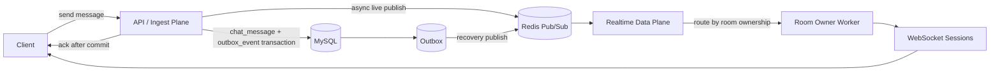

# 500명 x 3개 핫룸 동시 부하테스트 기준선 보고서

작성일: 2026-05-03  
브랜치: `perf-multi-hot-room-500x3-baseline`  
기준 브랜치: `perf-ack-first-async-live-outbox-recovery`

## 1. 실험 목적

이번 실험의 목적은 단일 핫룸 500명 성공 구조가 여러 핫룸이 동시에 생겼을 때도 유지되는지 확인하는 것이다.

바로 Realtime Gateway 분리나 room ownership을 구현하지 않고, 현재 구조인 `모놀리식 App + WebSocket/Fanout 혼합 구조`가 `500명 x 3방`에서 어느 공유 자원 때문에 흔들리는지 먼저 측정했다.

단일방 성공 기준선은 `250503-2139-idx`이다.

| 지표 | 단일방 500명 기준선 |
|---|---:|
| `chat_ack_roundtrip_ms p95` | `61ms` |
| `ws_visible_freshness_ms p95` | `208ms` |
| WebSocket 연결 성공률 | `100%` |
| HTTP error | `0%` |

## 2. 코드 변경 요약

이번 브랜치에서는 서비스 로직을 바꾸지 않았다. 변경 범위는 여러 핫룸을 측정하기 위한 k6 시나리오와 Terraform 변수/profile이다.

### 2.1 새 k6 시나리오

파일: `k6/scenarios/09-multi-hot-room-ramped.js`

추가한 동작:

- `HOT_ROOMS`만큼 방을 생성한다.
- 기본값은 `HOT_ROOMS=3`, `VUS_PER_ROOM=500`, `TARGET_VUS=1500`이다.
- 각 VU는 `(__VU - 1) % HOT_ROOMS`로 방에 배정된다.
- 각 방에 500명씩 들어가도록 한다.
- `CONNECT_RAMP_SECONDS=120` 동안 연결/입장을 분산한다.
- 각 사용자는 `SEND_INTERVAL_MS=1000`마다 메시지를 보낸다.

초기 smoke에서 닉네임에 `-`가 들어가 백엔드 검증에 걸렸다. 그래서 닉네임 prefix를 `MHR0-1` 형태가 아니라 `MHR0U1` 형태로 바꿨다.

### 2.2 WebSocket metric tag 확장

파일: `k6/lib/ws.js`

`connectAndChat()`에 `tags` 옵션을 추가했다. 이 덕분에 아래 지표를 방별로 나눠 볼 수 있다.

- `chat_ack_roundtrip_ms{roomIndex:room-0}`
- `ws_visible_freshness_ms{roomIndex:room-1}`
- `ws_connect_success_rate{roomIndex:room-2}`
- `ws_messages_sent_total{roomIndex:...}`
- `ws_messages_received_total{roomIndex:...}`
- `ws_realtime_omitted_messages_total{roomIndex:...}`

### 2.3 Terraform profile 추가

파일: `infra/gcp-loadtest/profiles/multi-hot-room-500x3.tfvars.example`

공식 측정 사양:

| 구성 | 값 |
|---|---:|
| App VM | `4 x e2-standard-8` |
| LB VM | `e2-standard-2` |
| MySQL VM | `e2-standard-4` |
| Redis VM | `e2-standard-4` |
| k6 VM | `e2-standard-16` |
| 총 vCPU | `58` |
| WebSocket lanes | `16` |
| VUs | `1500` |
| hot rooms | `3` |
| users per room | `500` |
| connect ramp | `120s` |
| chat duration | `120s` |
| send interval | `1000ms` |

Terraform 변수도 추가했다.

- `hot_rooms`
- `vus_per_room`

## 3. 검증

로컬 검증:

- `k6 inspect k6/scenarios/09-multi-hot-room-ramped.js` 통과
- `./gradlew test` 통과
- `terraform -chdir=infra/gcp-loadtest validate` 통과

GCP smoke:

| 항목 | 값 |
|---|---:|
| run id | `250503-2255-mhr-smoke2` |
| 방 수 | `3` |
| VU | `30` |
| 방별 VU | `10` |
| exit code | `0` |
| 연결 성공률 | `100%` |
| HTTP error | `0%` |
| visible freshness p95 | `128ms` |

Smoke VM은 자동 삭제 완료를 확인했다.

## 4. 공식 측정 결과

공식 run:

| 항목 | 값 |
|---|---:|
| run id | `250503-2310-mhr-500x3` |
| profile | `multi-hot-room-500x3` |
| VUs | `1500` |
| 방 수 | `3` |
| 방별 사용자 수 | `500` |
| exit code | `99` |
| VM 자동 삭제 | 완료 |

전체 결과:

| 지표 | 결과 | 목표 | 판단 |
|---|---:|---:|---|
| WebSocket 연결 성공률 | `100%` | `>= 99%` | 통과 |
| HTTP error | `0%` | `< 1%` | 통과 |
| `chat_ack_roundtrip_ms p50` | `94ms` | - | 보통 |
| `chat_ack_roundtrip_ms p95` | `385ms` | `<= 300ms` | 실패 |
| `chat_ack_roundtrip_ms p99` | `628ms` | - | 관리 가능 |
| `ws_visible_freshness_ms p50` | `9.9s` | - | 실패 |
| `ws_visible_freshness_ms p95` | `75.891s` | `<= 500ms` | 크게 실패 |
| `ws_visible_freshness_ms p99` | `80.487s` | - | 크게 실패 |
| 송신 메시지 수 | `178,933` | - | 측정됨 |
| ack 수신 수 | `178,502` | 송신 수와 근접 | 약 `431`개 차이 |
| WebSocket 수신 논리 메시지 수 | `10,828,872` | - | 측정됨 |
| WebSocket 수신 frame 수 | `1,062,704` | - | batch 효과 있음 |
| omitted message 수 | `20,226,240` | - | controlled realtime cap 작동 |

방별 결과:

| 방 | 연결 성공률 | ack p95 | visible freshness p95 | 송신 수 | 수신 논리 메시지 수 | omitted 수 |
|---|---:|---:|---:|---:|---:|---:|
| room-0 | `100%` | `387ms` | `75.843s` | `59,641` | `3,626,319` | `6,733,326` |
| room-1 | `100%` | `387ms` | `75.928s` | `59,645` | `3,607,356` | `6,738,276` |
| room-2 | `100%` | `383ms` | `75.938s` | `59,647` | `3,595,197` | `6,754,638` |

방별 편차는 크지 않았다. 즉 특정 방 하나가 터진 것이 아니라, 세 방 모두 같은 공유 경로에서 비슷하게 밀렸다.

## 5. 단일방 기준선과 비교

| 지표 | 단일방 500명 `250503-2139-idx` | 3방 x 500명 `250503-2310-mhr-500x3` | 변화 |
|---|---:|---:|---:|
| 연결 성공률 | `100%` | `100%` | 유지 |
| HTTP error | `0%` | `0%` | 유지 |
| ack p95 | `61ms` | `385ms` | 약 `6.3배` 악화 |
| visible freshness p95 | `208ms` | `75.891s` | 약 `365배` 악화 |

연결 수 자체는 버틴다. 문제는 연결 안정성이 아니라, 메시지가 사용자의 화면에 최신 상태로 도달하는 속도다.

## 6. 병목 판단

### 6.1 WebSocket lane 자체가 주 병목은 아니다

앱 Prometheus snapshot 기준:

| 서버 내부 지표 | p95 |
|---|---:|
| `ws.broadcast.lane.queue_wait` | 약 `1.0ms ~ 1.2ms` |
| `ws.broadcast.lane.worker.total` | 약 `0.6ms ~ 0.7ms` |
| `ws.broadcast.lane.send.total` | 약 `0.2ms` |
| `subscribe.redis.fanout_call` | 약 `0.02ms` 이하 |
| `fanout.total` | 약 `0.014ms` 이하 |

따라서 이번 결과의 75초 지연은 WebSocket lane queue가 직접 막혀서 생긴 것이 아니다.

### 6.2 live publish 앞단이 밀린다

각 App에서 `openchat_live_publish_queue_size_max`가 크게 쌓였다.

| App | live publish queue max |
|---|---:|
| app-1 | `18,533` |
| app-2 | `20,176` |
| app-3 | `19,472` |
| app-4 | `18,870` |

Redis publish 자체는 빠르다.

| 지표 | p95 |
|---|---:|
| `live_publish.redis` | 약 `0.8ms` |
| `publish.redis.convert_and_send` | 약 `0.8ms ~ 1ms` |

그런데 `live_publish.total`은 p95 약 `65ms`, max 약 `0.8s ~ 1.1s`까지 올라갔고, pending queue가 크게 쌓였다. 즉 Redis 호출이 느린 것이 아니라, live publish executor가 처리해야 할 작업량을 따라가지 못했다.

### 6.3 저장 경로도 ack p95에 영향을 준다

ack는 DB commit 후 보내는 구조다. 서버 내부 ack send 자체는 매우 빠르다.

| 지표 | p95 |
|---|---:|
| `ack.after_commit` | 약 `0.1ms` |
| `ws.control.ack.send` | 약 `0.09ms` |

하지만 DB 저장 transaction 구간이 커졌다.

| 지표 | p95 |
|---|---:|
| `ingest.outbox_save` | 약 `71ms ~ 75ms` |
| `ingest.persist.total` | 약 `100ms ~ 105ms` |

그래서 사용자 기준 ack p95는 `385ms`까지 올라갔다. 단일방 500명에서는 `61ms`였으므로, 여러 핫룸에서는 MySQL/outbox 저장 경로도 같이 압박을 받는다.

### 6.4 outbox backlog도 커졌다

`openchat_outbox_pending_count_max`가 약 `76k`까지 관측됐다.

| App snapshot | outbox pending max |
|---|---:|
| app-1 | `76,710` |
| app-2 | `76,660` |
| app-3 | `75,930` |
| app-4 | `76,200` |

이 값은 각 앱이 같은 DB의 pending 상태를 관측한 값으로 봐야 한다. outbox는 복구 경로인데도 backlog가 크게 쌓였다. live publish가 충분히 빨리 PUBLISHED 처리하지 못하고, worker도 전체 backlog를 즉시 따라잡지 못한 것으로 판단된다.

### 6.5 방별 편차가 작다는 것이 중요하다

room-0, room-1, room-2 모두 visible freshness p95가 약 `75.8s ~ 75.9s`다.

이건 "특정 방 하나가 느려서 다른 방까지 망가졌다"기보다, 현재 구조에서 여러 핫룸이 같은 App/DB/Redis/live publish executor를 공유하면서 전역 처리량 한계를 만난 결과에 가깝다.

## 7. 결론

이번 구조는 `500명 x 3개 핫룸`을 사용자 체감 기준으로 통과하지 못했다.

다만 의미 있는 점은 있다.

- 1500 WebSocket 연결은 안정적으로 유지됐다.
- HTTP error는 없었다.
- WebSocket lane queue는 거의 밀리지 않았다.
- 문제는 연결 수가 아니라, 다중 핫룸에서 live publish와 DB/outbox 저장 경로가 공유 자원으로 병목이 되는 점이다.

따라서 다음 단계는 단순히 WebSocket lane을 더 늘리는 것이 아니다. 이미 lane은 비어 있다. 다음은 아래 방향으로 가야 한다.

1. live publish executor를 room 단위로 격리한다.
2. hot room별 publish budget과 queue를 분리한다.
3. room ownership을 도입해 한 방의 live publish 경로가 특정 realtime worker에 귀속되게 한다.
4. App 서버의 HTTP/DB ingest 경로와 WebSocket/Fanout 경로를 분리한다.
5. outbox worker는 복구 전용으로 유지하되, backlog를 줄이기 위해 `PUBLISHED` mark 처리와 polling 정책을 개선한다.

## 8. Realtime Gateway / Room Ownership 필요성

이번 결과만 보면 Realtime Gateway 분리의 근거가 생겼다.

이유는 다음과 같다.

- 세 방이 거의 같은 정도로 느려졌다.
- WebSocket lane은 병목이 아니었다.
- live publish queue와 outbox pending이 전역적으로 쌓였다.
- DB 저장 p95도 단일방보다 커졌다.

따라서 포트폴리오 목표를 `500명 방 여러 개를 운영 가능한 서비스`로 잡는다면, 다음 구조가 더 설득력 있다.

이 구조의 핵심은 "방 단위 실시간 처리량을 API 서버 전체 공유 executor에 섞지 않는다"는 점이다.

## 9. 다음 실험 제안

다음 실험은 코드 구조를 크게 바꾸기 전에 작게 잘라서 확인하는 편이 낫다.

1. `PostCommitLivePublishService`를 room striped executor로 변경한다.
   - 현재 live publish queue가 앱별로 크게 쌓인다.
   - room별 stripe를 두면 여러 방이 같은 executor queue에서 섞이는 정도를 줄일 수 있다.

2. live publish queue wait metric을 추가한다.
   - 지금은 queue size와 live_publish.total로 추정하고 있다.
   - `live_publish.queue_wait`를 직접 찍어야 병목을 더 정확히 판단할 수 있다.

3. outbox `PUBLISHED` mark 처리를 batch화한다.
   - 메시지마다 DB update하면 outbox 테이블이 ingest DB와 경쟁한다.
   - 성공 publish 이벤트를 모아 batch update하거나 worker 전용 thread/connection pool을 분리한다.

4. Realtime data plane 분리 실험을 별도 브랜치에서 진행한다.
   - API App은 저장과 ack에 집중한다.
   - Realtime App은 Redis subscribe, room ownership, WebSocket push만 담당한다.

이번 측정은 실패지만, 실패 지점이 분명해졌다. 현재 다음 병목은 WebSocket send가 아니라 `다중 핫룸에서 공유 live publish/outbox/DB 경로가 밀리는 문제`다.
